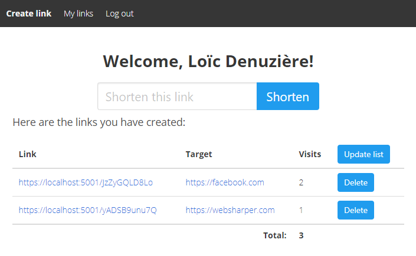
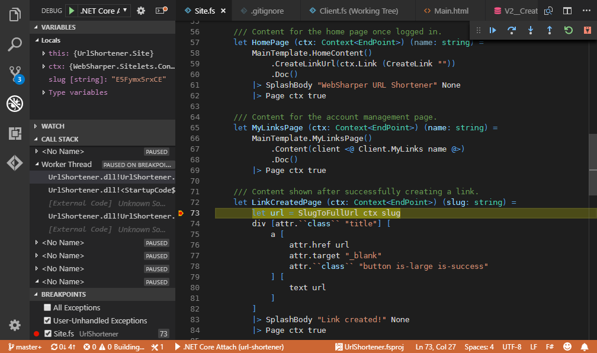
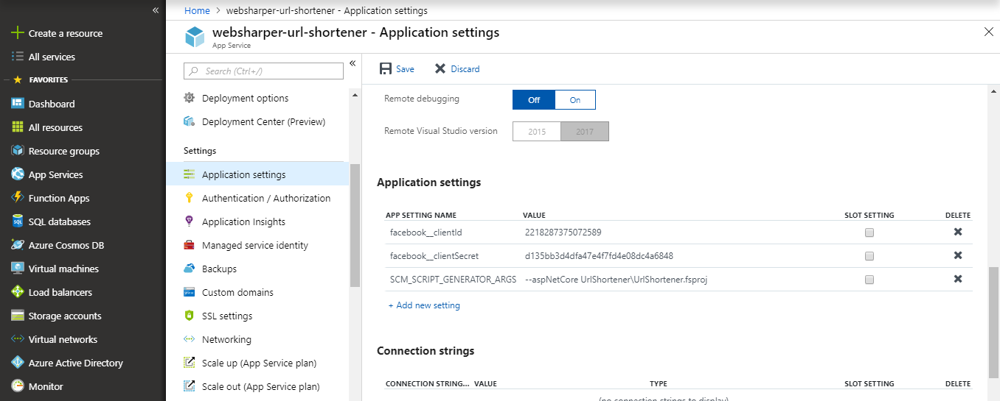

# WebSharper URL Shortener

This project demonstrates how to use [WebSharper](https://websharper.com) to build the server side and client side of a web application.

It features:
* a server side using [WebSharper sitelets](https://developers.websharper.com/docs/v4.x/fs/sitelets) hosted on ASP.NET Core;
* a SQLite database driven by [SQLProvider](https://fsprojects.github.io/SQLProvider/), with schema migrations using [Evolve](https://evolve-db.netlify.com/);
* Facebook login using OAuth;
* a [Model-View-Update](https://dotnet-websharper.github.io/mvu) client side page, using [WebSharper remoting](https://developers.websharper.com/docs/v4.x/fs/remoting) for server interaction;
* reactive DOM construction, using both HTML templates and F# HTML functions.

[](https://websharper-url-shortener.azurewebsites.net/)

You can see it running on Azure [here](https://websharper-url-shortener.azurewebsites.net/).

## Requirements

* [The .NET Core SDK](https://www.microsoft.com/net/download), version 2.1.302 or newer.
* On Windows: .NET Framework 4.6.1 (select it in Visual Studio installer, or download the Dev Pack [here](https://www.microsoft.com/net/download/dotnet-framework/net461)).
* On OSX or Linux: [Mono 5.10 or newer](https://www.mono-project.com/download/stable/).

## Developing

The recommended way to develop on this project on all platforms is using [Visual Studio Code](https://code.visualstudio.com/) with the following extensions:

* **Ionide-fsharp** for F# language support.
* **C#** (optionally) for the server side debugger.

To get running, start the "Run Build Task" command (`Ctrl+Shift+B` by default) and select the "watch" task. This starts a job that compiles the application, starts it at urls `http://localhost:5000` and `https://localhost:5001`, and restarts this process when you save an F# file.

For the same effect from the command line, run `dotnet watch run` in the `UrlShortener` folder. Note that this needs the following environment variables set in the shell where you run it:
* `ASPNETCORE_ENVIRONMENT`: `development` declares that this is a development environment (as opposed to eg. `staging` or `production`). It is used, among other things, to determine which `appSettings` file to use (see below).
* If you're running Linux: `LD_LIBRARY_PATH`: `<workspace folder>/packages/System.Data.SQLite.Core/runtimes/linux-x64/lib/netstandard2.0` allows the compiler and the application to find the required SQLite native library.
* If you're running OSX: `LD_LIBRARY_PATH`: `<workspace folder>/packages/System.Data.SQLite.Core/runtimes/osx-x64/lib/netstandard2.0` allows the compiler and the application to find the required SQLite native library.



## Setting up the Facebook login provider

The application demonstrates the use of OAuth login with Facebook. This means that you need a Facebook application set up to be able to log into the application. For this, you need to create a developer account on [the Facebook developer console](https://developers.facebook.com), then create an App and add Facebook Login to it.

UrlShortener retrieves the application credentials (app ID and app Secret, which you can retrieve on the Facebook console under Settings > Basic) from the application configuration. The simplest way to set it up is to create a file called `appSettings.development.json` in the `UrlShortener` directory with the following content:

```json
{
    "facebook": {
        "clientId": "your app id here",
        "clientSecret": "your app secret here"
    }
}
```

It is *not* recommended to add the above to the general `appSettings.json`: this file is committed to git, and you should never commit such credentials to source control under any circumstances.

## Deploying to Azure

This application is easy to deploy as an Azure web app. Here are the steps:

* Create a Windows Web App on the [Azure Portal](https://portal.azure.com).
* Under "Application settings", add the following application settings:
    * `SCM_SCRIPT_GENERATOR_ARGS`: `--aspNetCore UrlShortener\UrlShortener.fsproj` tells Azure where to find the application to run.
    * `facebook__clientId`: `your app id here` (note the double underscore) sets the OAuth client id for the Facebook application. It is equivalent to the above `appSettings.development.json`.
    * `facebook__clientSecret`: `your app id here` similarly sets the OAuth client secret.
* Under "Deployment options", set up the deployment method of your choice.
    * "Local git" is a good option: it creates a git repository that you can simply push to and the application will be built and deployed. You will need to set up the git login/password under "Deployment credentials", and retrieve the git repository URL under "Deployment Center".
    * Alternately, if you forked this repository on Github, the "Github" option will trigger a deployment every time you push there, without having to push to a separate repository.

[](https://portal.azure.com)

## Going further

* [WebSharper home page](https://websharper.com)
* [WebSharper documentation](https://developers.websharper.com)
* [More WebSharper samples](https://github.com/websharper-samples)

Happy coding!
